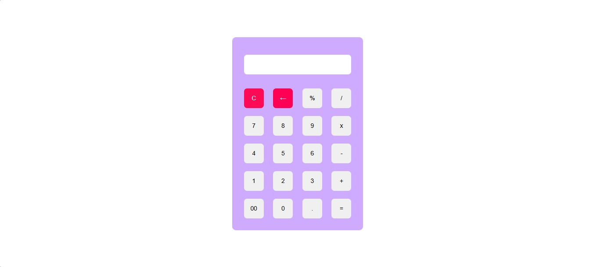

# Calculator Web Application

A simple and responsive web-based calculator that performs basic arithmetic operations. Built with HTML, CSS, and JavaScript.

## Features

- Perform arithmetic operations: addition, subtraction, multiplication, division, and modulus.
- Clear screen functionality.
- Backspace to delete the last input.
- Keyboard support for easier input.
- User-friendly and responsive design.

## Demo

## Keyboard Shortcuts

  | **Key**        | **Action**            |
|-----------------|-----------------------|
| Numbers 0–9     | Input numbers         |
| `+`, `-`, `/`, `%`, `*` | Perform operations  |
| `Enter`         | Calculate result      |
| `C`             | Clear input           |
| `Backspace`     | Delete last input     |

## To run the website on,

- web browser (e.g., Chrome, Firefox, Edge).
